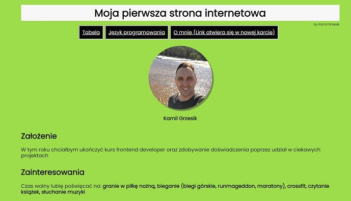

# Kamil Grzesik

## Demo 

*My first coding course website:*

https://kamil-g-84.github.io/Homepage/

## Description

This is my first coding project, so I hope it stays here because it will have sentimental value for me, but it will also show me where I've been and where I'll be soon.

## Technologies used:
- HTML
- JavaScript
- CSS
- BEM convention
- Normalize
- GIT

## CSS:
This folder is divided into 5 files : header.css, navigation.css, section.css, style.css and table.css. Each of them steels individual elements on the page.

## JavaScript:
In this folder there is a script.js file in which the algorithm that changes the background color and displays my target, that is JVA SCRIPT, is written. More specifically, I mean to master this programming language to a degree that will allow me to work on interesting projects.

## How it works?

Instructions on how the effect works on the website. Pressing the button changes the background color and shows the goal to be achieved.

## ✳ => [Video instruction](https://www.youtube.com/watch?v=e5qZND4fPVA) <=✳

## README
Readme will evolve with the project. Be sure to check back here often to stay up to date.
